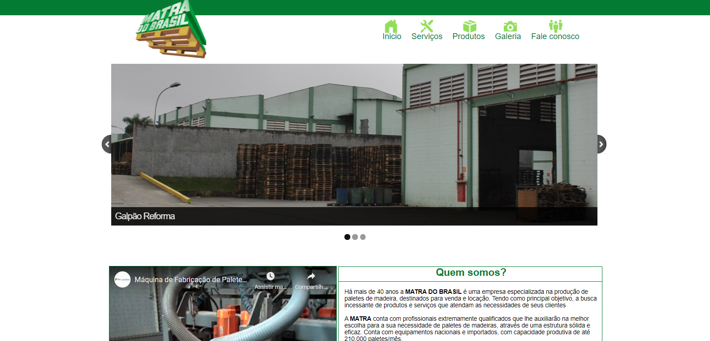

<h1 align="center">Matra do Brasil</h1>

  
  <a aria-label="HTML5" href="#">
    </img>
  </a>
  <a aria-label="CSS3" href="#">
    </img>
  </a>
   <a aria-label="Javascript" href="#">
    </img>
  </a>

# PT-BR

## Descrição
Esse foi meu primeiro projeto profissional realizado para empresa Matra do Brasil em 2016.
Com esse projeto pude ter noções maiores de design e edição de imagem.
As páginas são feitas em HTML5 e CSS3, foi usado PHP7 para a página de contato.

# EN

## Description

This was my first professional project carried out for Matra do Brasil in 2016.
With this project I could have greater notions of design and image editing.
The pages are made in HTML5 and CSS3, PHP7 was used for the contact page.

<a heref="https://ddparkas.github.io/Matra/">Site no ar / Site in live</a>

</img>
